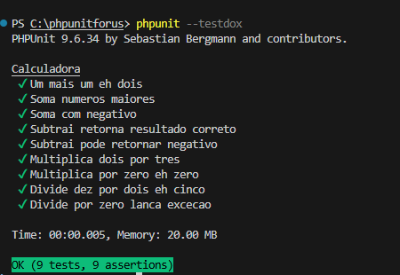

# phpunitforus

Guia prático para rodar testes com PHPUnit — sem Composer, sem framework, só PHP puro!

---

## Estrutura do projeto

```
meu-projeto/
├── libs/
│   └── phpunit-9.6.34.phar     <- o motor dos testes (baixar uma vez)
├── src/
│   └── Calculadora.php         <- suas classes PHP ficam aqui
├── tests/
│   ├── bootstrap.php           <- carrega as classes antes dos testes rodarem
│   └── Unit/
│       └── CalculadoraTest.php <- seus testes ficam aqui
└── phpunit.xml                 <- configuração do PHPUnit
```

---

## Passo a passo

**1** — Baixar o PHP 7.4 (Windows 64-bit):
```
https://phpdev.toolsforresearch.com/php-7.4.33-Win32-vs16-x64.zip
```
Descompactar em `C:\php-7.4\`

**2** — Baixar o PHPUnit (.phar):
```
https://phar.phpunit.de/phpunit-9.6.phar
```
Renomear para `phpunit-9.6.34.phar` e colocar em `libs/`

**3** — Clonar ou copiar este repositório como ponto de partida.

**4** — *(Opcional, mas recomendado)* Criar aliases no PowerShell para não precisar digitar o caminho completo toda vez:

```powershell
# 1. Criar o arquivo de perfil do PowerShell (equivale ao .bashrc no Linux)
New-Item -ItemType Directory -Force -Path (Split-Path $PROFILE)

# 2. Escrever os aliases no perfil
@'
# --- PHP aliases ---
Set-Alias php C:\php-7.4\php.exe

function phpunit {
    & C:\php-7.4\php.exe libs/phpunit-9.6.34.phar @args
}
'@ | Set-Content $PROFILE -Encoding UTF8

# 3. Liberar execução de scripts locais
Set-ExecutionPolicy -ExecutionPolicy RemoteSigned -Scope CurrentUser -Force
```

> A partir daí, qualquer sessão nova do PowerShell já carrega os aliases automaticamente.

---

## Rodando os testes

Com os aliases configurados, dentro da pasta do projeto:

```powershell
phpunit                              # roda todos os testes
phpunit --filter CalculadoraTest     # só uma classe
phpunit --filter testUmMaisUmEhDois  # só um método
phpunit --testdox                    # output mais descritivo
```

Sem aliases (caminho completo):

```powershell
C:\php-7.4\php.exe libs/phpunit-9.6.34.phar
C:\php-7.4\php.exe libs/phpunit-9.6.34.phar --filter CalculadoraTest
C:\php-7.4\php.exe libs/phpunit-9.6.34.phar --testdox
```

---

## Escrevendo seus testes

O arquivo `src/Calculadora.php` é um exemplo de classe PHP simples.
O arquivo `tests/Unit/CalculadoraTest.php` mostra como testá-la.

Exemplo mínimo de teste:

```php
public function testUmMaisUmEhDois(): void
{
    $calc = new Calculadora();
    $this->assertSame(2, $calc->soma(1, 1));
}
```

Para adicionar suas próprias classes: coloque em `src/` e crie o arquivo de teste correspondente em `tests/Unit/`.

---
## Imagem terminal rodando


